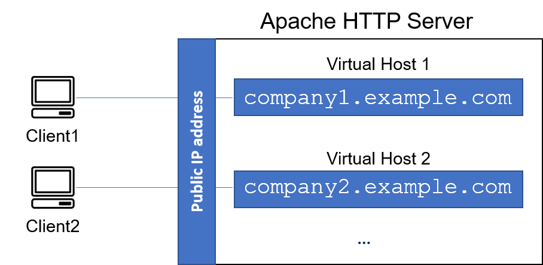

# Web stack implementation (lamp stack) in aws

This shows a simple implementation of a web stack in aws.<br>
Note: The EC2 instance is not created here. It has been created already

### STEP 1 — INSTALLING APACHE AND UPDATING THE FIREWALL

1. Install Apache using the following commands:
```
#update a list of packages in package manager
 sudo apt update

#run apache2 package installation
 sudo apt install apache2
```
 

2. Verify your installation by running the following command:
```
 sudo service apache2 status
```
 
3. Add a new inbound rule to the EC2 Instance's firewall; this will allow the
 EC2 Instance to receive HTTP requests from the Internet.
  

4. Access you new apache web server using the following URL:
```
 http://<ec2-instance-public-ip-address>
```
 
NOTE: The EC2 Instance's public IP address can be found by running the following command:
```
 curl -s http://169.254.169.254/latest/meta-data/public-ipv4
```

### STEP 2 — INSTALLING MYSQL AND UPDATING THE FIREWALL

1. Install MySQL using the following commands:
```
sudo apt install mysql-server
```
2. You need to run security script 
that comes pre-installed with MySQL. This script will remove some insecure default settings and lock down access to your database system. Start the interactive script by running:
```
sudo mysql_secure_installation
```
This will ask you to configure the validation plugin which helps with passsword strength check. If one wants it enabaled; answer Y to the prompt If not, press any other key.
 

<b> NOTE: Always use a strong password for MySQL. </b>

3. Test your MySQL installation by running the following command:
```
sudo mysql
```
If installation is successful, you should see the following message:
 

<b>Note: At the time of this writing, the native MySQL PHP library mysqlnd doesn’t support caching_sha2_authentication, the default authentication method for MySQL 8. For that reason, when creating database users for PHP applications on MySQL 8, you’ll need to make sure they’re configured to use mysql_native_password instead.</b>

### STEP 3 — INSTALLING PHP
To install these 3 packages at once, run:
```
sudo apt install php libapache2-mod-php php-mysql
```
The command above will install the following packages:
<br>PHP </br>
<br>libapache2-mod-php to enable Apache to handle PHP files</br>
<br>php-mysql, a PHP module that allows PHP to communicate with MySQL-based databases.</br>

<b>NOTE:</b> In order to host our files and folders, we need to configure an Apache Virtual Host. <br><i> Apache Virtual Host to hold your website’s files and folders. Virtual host allows you to have multiple websites located on a single machine and users of the websites will not even notice it.</i></br>

Image

### STEP 4 — CONFIGURING APACHE VIRTUAL HOST

To create a domain (e.g projectlamp) for an app we need to create a virtual host for the domain. 
 

1. Create the directory for projectlamp using ‘mkdir’ command as follows:
```
sudo mkdir /var/www/projectlamp
```
2. Assign ownership of the directory to current user using ‘chown’ command as follows:
```
 sudo chown -R $USER:$USER /var/www/projectlamp
```
3. Create and open a new configuration file in Apache's <b>sites-available </b>directory using vi editor command as follows:
```
sudo vi /etc/apache2/sites-available/projectlamp.conf
```
4. Add the following lines to the file:
```
<VirtualHost *:80>
    ServerName projectlamp
    ServerAlias www.projectlamp 
    ServerAdmin webmaster@localhost
    DocumentRoot /var/www/projectlamp
    ErrorLog ${APACHE_LOG_DIR}/error.log
    CustomLog ${APACHE_LOG_DIR}/access.log combined
</VirtualHost>
```
If you do "ls" command, one will see projectlamp.conf

5. Enable the virtual host using the a2ensite command as follows:
```
sudo a2ensite projectlamp
```
6. Disable default apache configuration using the a2dissite command as follows:
```
sudo a2dissite 000-default  #disable default apache configuration
```
7. Restart Apache using the following command:
```
sudo service apache2 restart  
```
8. In order to access the website, we need to create an index.php file in the projectlamp directory and output a message.
```
sudo echo 'Hello LAMP from hostname' $(curl -s http://169.254.169.254/latest/meta-data/public-hostname) 'with public IP' $(curl -s http://169.254.169.254/latest/meta-data/public-ipv4) > /var/www/projectlamp/index.html
```
9. Verify the website by visiting:
```
http://<Public-IP-Address>:80
``` 
 
### STEP 5 — ENABLE PHP ON THE WEBSITE
<b>NOTE: With the default DirectoryIndex settings on Apache, a file named index.html will always take precedence over an index.php file. This is useful for setting up maintenance pages in PHP applications. </b>

To change the default behavior of Apache, we need to enable PHP on the website.

1. Change the order of precedence of index.php and index.html files using the following command to edit dir.conf file:
```
sudo vi /etc/apache2/mods-enabled/dir.conf
```
Then add the following line to the file:

```
<IfModule mod_dir.c>
        #Change this:
        #DirectoryIndex index.html index.cgi index.pl index.php index.xhtml index.htm
        #To this:
        DirectoryIndex index.php index.html index.cgi index.pl index.xhtml index.htm
</IfModule>
```
2. Restart Apache using the following command:
```
sudo service apache2 restart
```
3. Create an index.php file in the projectlamp directory and output a message.
```
vim /var/www/projectlamp/index.php
```
4. Add the following lines to the file:
```
<?php
phpinfo();
```
5. Verify the website by visiting the website url
 