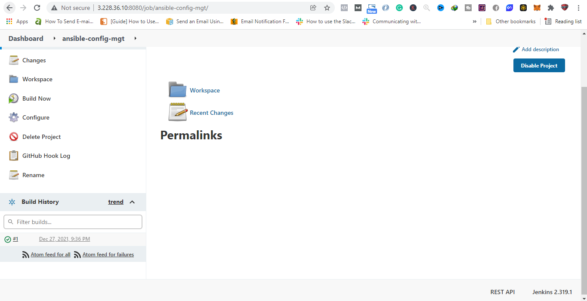

# ANSIBLE – AUTOMATE PROJECT 7 TO 10

### STEP 1 - INSTALL AND CONFIGURE ANSIBLE ON EC2 INSTANCE

1. Using the same server used for Jenkins as our ansible server 

2. Created a new repo called ansible-config-mgt.

3. Installed Ansible
```
sudo apt update

sudo apt install ansible
```


4. Setup Jenkins project to automatically build the ansible-config-mgt repo once there is an update to master branch




### STEP 2 - SETUP PROJECT ON VISUAL STUDIO CODE 

I have visual code already installed and project folder opened for

### STEP 3 - BEGIN ANSIBLE DEVELOPMENT

1. Create a new feature branch to develop the ansible playbook

2. Checkout the feature branch
3. Create a **playbook** directory - holds the ansible tasks and operations to be performed.
4. Create an **inventory** directory - holds the hosts file.
5. Create a common.yml file inside the playbook directory. This contains some of tasks to be run on all the hosts.
6. Create hosts file(dev.yml,staging.yml,uat.yml and prod.yml) inside the inventory directory. These files contains the list of hosts to be managed.

### STEP 4 – SETUP ANSIBLE INVENTORY

1. Update the inventory/dev.yml file with the following content
```
[nfs]
<NFS-Server-Private-IP-Address> ansible_ssh_user='ec2-user'

[webservers]
<Web-Server1-Private-IP-Address> ansible_ssh_user='ec2-user'
<Web-Server2-Private-IP-Address> ansible_ssh_user='ec2-user'

[db]
<Database-Private-IP-Address> ansible_ssh_user='ec2-user' 

[lb]
<Load-Balancer-Private-IP-Address> ansible_ssh_user='ubuntu'
```
2. We need to import our .pem file into the ansible server in order to execute the anisble playbook.<br>

We can acheive this by running the following command to add the .pem file to SSH Agent
```
eval `ssh-agent -s` #starts the ssh agent if its not running.
ssh-add <path-to-private-key> # adds the .pem to the ssh Agent
ssh-add -l # lists the keys in the ssh agent
```

3. SSH into the jenkins server;
```
ssh -A ubuntu@public-ip
```

### STEP 5 – CREATE ANSIBLE PLAYBOOK
1. Update the playbook/common.yml file with the following content:
```
---
- name: update web, nfs and db servers
  hosts: webservers, nfs, db
  remote_user: ec2-user
  become: yes
  become_user: root
  tasks:
    - name: ensure wireshark is at the latest version
      yum:
        name: wireshark
        state: latest

    - name: create new directory
      file:
        path: /home/ec2-user/wales
        state: directory    

- name: update LB server
  hosts: lb
  remote_user: ubuntu
  become: yes
  become_user: root
  tasks:
    - name: Update apt repo
      apt: 
        update_cache: yes

    - name: ensure wireshark is at the latest version
      apt:
        name: wireshark
        state: latest

    - name: create new directory
      file:
        path: /home/ubuntu/wales
        state: directory     
```
2. Save the project and push the branch to GitHub. Also create a PR to merge the branch to master.


3. Automatic build is triggered on jenkins and the files are copied to the jenkins server at ansible-playbook -i /var/lib/jenkins/jobs/ansible-config-mgt/builds/<build number>/archive

4. Run the ansible playbook using the following command:
```
ansible-playbook -i /var/lib/jenkins/jobs/ansible-config-mgt/builds/<build number>/archive/inventory/dev.yml /var/lib/jenkins/jobs/ansible-config-mgt/builds/<build number>/archive/playbook/common.yml --forks 1
```


5. Check the server to confirm the changes are reflected. Check if wireshark is installed and the directory is created.
```
wireshark --versions
```
