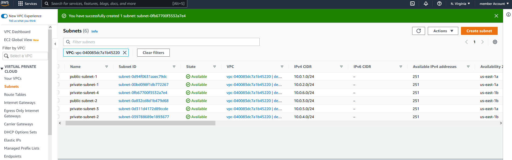

# AWS CLOUD SOLUTION FOR 2 COMPANY WEBSITES USING A REVERSE PROXY TECHNOLOGY

## **BACKSTORY:**

Built a secure infrastructure inside AWS VPC (Virtual Private Cloud) network for a company that uses WordPress CMS for its main business website, and a Tooling Website for their DevOps team. As part of the company’s desire for improved security and performance, a decision was made to use a reverse proxy technology from NGINX to achieve this.
</br>

The infrastructure for both websites, WordPress and Tooling, is resilient to Web Server’s failures, can accomodate to increased traffic and, at the same time, has reasonable cost.


## STEP 1: SET UP ORGANISATION UNIT (OU) and  a SUB-ACCOUNT
1. Properly configure your AWS account and Organization Unit (https://youtu.be/9PQYCc_20-Q)

- Created an AWS Master account. (Also known as Root Account)

- Within the Root account, create a sub-account and name it DevOps. (You will need another email address to complete this)
- Within the Root account, create an AWS Organization Unit (OU). Name it Dev. (We will launch Dev resources in there)
- Move the DevOps account into the Dev OU.
- Login to the newly created AWS account using the new email address.


2. Created a free domain name for company at Freenom domain registrar here (https://www.freenom.com/).

3.  Created a hosted zone in AWS, and map it to your free domain from Freenom. Check how to do this here (https://youtu.be/IjcHp94Hq8A).


## STEP 2: CREATE AN AWS VPC


### Set Up a Virtual Private Network (VPC)

1. Created a VPC
2. Created subnets as shown in the architecture


3. Created a route table and associate it with public subnets

4. Created a route table and associate it with private subnets

5. Created an Internet Gateway

6. Edit a route in public route table, and associate it with the Internet Gateway. (This is what allows a public subnet to be accisble from the Internet)

7. Created 3 Elastic IPs

8. Created a Nat Gateway and assigned one of the Elastic IPs (*The other 2 was used by Bastion hosts)

9. Created security groups for different services in the architecture
 
 - **Nginx Servers:** Access to Nginx should only be allowed from a Application Load balancer (ALB). At this point, we have not created a load balancer, therefore we will update the rules later. For now, just create it and put some dummy records as a place holder.

- **Bastion Servers:** Access to the Bastion servers should be allowed only from workstations that need to SSH into the bastion servers. Hence, you can use your workstation public IP address. (This is the IP address that you will use to SSH into the bastion servers). **On inbound rules, pick TCP (22) and choose my IP (just to prevent an attempt from a hacker to SSH into the bastion servers).
**
- **Application Load Balancer:** ALB will be available from the Internet

- **Webservers:** Access to Webservers should only be allowed from the Nginx servers. Since we do not have the servers created yet, just put some dummy records as a place holder, we will update it later.

- **Data Layer:** Access to the Data layer, which is comprised of Amazon Relational Database Service (RDS) and Amazon Elastic File System (EFS) must be carefully desinged – only webservers should be able to connect to RDS, while Nginx and Webservers will have access to EFS Mountpoint.


### Set Up Compute Resources for Nginx

#### Provision EC2 Instances for Nginx

1. Create an EC2 Instance based on CentOS Amazon Machine Image (AMI) in any 2 Availability Zones (AZ) in any AWS Region close to the target users. Use EC2 instance of T2 family (e.g. t2.micro or similar)

2. Ensure that it has the following software installed: python, ntp,net-tools,vim,wget,telnet,epel-release,htop.

3. Create an AMI out of this instance

#### Prepare Launch Template For Nginx (One Per Subnet)

1. Make use of the AMI to set up a launch template

2. Ensure the Instances are launched into a public subnet (public subnet 1 or 2)

3. Assign appropriate security group (NGINX SG)
4. Configure Userdata to update yum package repository and install nginx
   * choose the instance name and stop it
   * click on **actions >> instance settings >> edit userdata** to create a userdata script
   * click on the userdata script to edit it
   ```
   Content-Type: multipart/mixed; boundary="//"
    MIME-Version: 1.0

    --//
    Content-Type: text/cloud-config; charset="us-ascii"
    MIME-Version: 1.0
    Content-Transfer-Encoding: 7bit
    Content-Disposition: attachment; filename="cloud-config.txt"

    #cloud-config
    cloud_final_modules:
    - [scripts-user, always]

    --//
    Content-Type: text/x-shellscript; charset="us-ascii"
    MIME-Version: 1.0
    Content-Transfer-Encoding: 7bit
    Content-Disposition: attachment; filename="userdata.txt"

    #!/bin/bash
    yum update -y
    yum install nginx -y
    --//--
    ```

   * click on the save button
   * start the instance.

#### Configure Target Groups
Go to Target Groups section and create a new target group.
1. Select Instances as the target type
2. Ensure the protocol HTTPS on secure TLS port 443
3. Ensure that the health check path is /healthstatus
4. Register Nginx Instances as targets
5. Ensure that health check passes for the target group   


#### Configure Autoscaling For Nginx
1. Select the right launch template

2. Select the VPC

3. Select both public subnets
4. Enable Application Load Balancer for the AutoScalingGroup (ASG)

5. Select the target group you created before
6. Ensure that you have health checks for both EC2 and ALB

7. The desired capacity is 2
8. Minimum capacity is 2
9. Maximum capacity is 4
10. Set scale out if CPU utilization reaches 90%

11. Ensure there is an SNS topic to send scaling notifications


### Set Up Compute Resources for Bastion

#### Provision the EC2 Instances for Bastion
1. Create an EC2 Instance based on CentOS Amazon Machine Image (AMI) per each Availability Zone in the same Region and same AZ where you created Nginx server
2. Ensure that it has the following software installed: python, ntp,net-tools,vim,wget,telnet,epel-release,htop.
3. Associate an Elastic IP with each of the Bastion EC2 Instances
4. Create an AMI out of the EC2 instance

#### Prepare Launch Template for Bastion (One Per Subnet)
1. Make use of the AMI to set up a launch template
2. Ensure the Instances are launched into a private subnet (private subnet 1 or 2)
3. Assign appropriate security group (Bastion SG)
4. Configure Userdata to update yum package repository and install ansible and git
   * choose the instance name and stop it
   * click on **actions >> instance settings >> edit userdata** to create a userdata script
   * click on the userdata script to edit it
   ```
   Content-Type: multipart/mixed; boundary="//"
    MIME-Version: 1.0

    --//
    Content-Type: text/cloud-config; charset="us-ascii"
    MIME-Version: 1.0
    Content-Transfer-Encoding: 7bit
    Content-Disposition: attachment; filename="cloud-config.txt"

    #cloud-config
    cloud_final_modules:
    - [scripts-user, always]

    --//
    Content-Type: text/x-shellscript; charset="us-ascii"
    MIME-Version: 1.0
    Content-Transfer-Encoding: 7bit
    Content-Disposition: attachment; filename="userdata.txt"

    #!/bin/bash
    yum update -y
    yum install ansible git  -y
    --//--
    ```

   * click on the save button
   * start the instance.

#### Configure Target Groups
Go to Target Groups section and create a new target group.
1. Select Instances as the target type
2. Ensure the protocol HTTPS on secure TLS port 443
3. Ensure that the health check path is /healthstatus
4. Register Bastion Instances as targets
5. Ensure that health check passes for the target group


#### Configure Autoscaling For Bastion
1. Select the right launch template
2. Select the VPC
3. Select both public subnets
4. Enable Application Load Balancer for the AutoScalingGroup (ASG)
5. Select the target group you created before
6. Ensure that you have health checks for both EC2 and ALB
7. The desired capacity is 2
8. Minimum capacity is 2
9. Maximum capacity is 4
10. Set scale out if CPU utilization reaches 90%
11. Ensure there is an SNS topic to send scaling notifications

### Set Up Compute Resources for Webservers
#### Provision the EC2 Instances for Webservers

create 2 separate launch templates for both the WordPress and Tooling websites

1. Create an EC2 Instance (Centos) each for WordPress and Tooling websites per Availability Zone (in the same Region).

**N.B:** I used userdata to install the apps in step 2 below:
  * At the **Configure Instance stage ** in creating an instance, scroll down to userdata session and insert the following:
    ```
    Content-Type: multipart/mixed; boundary="//"
    MIME-Version: 1.0

    --//
    Content-Type: text/cloud-config; charset="us-ascii"
    MIME-Version: 1.0
    Content-Transfer-Encoding: 7bit
    Content-Disposition: attachment; filename="cloud-config.txt"

    #cloud-config
    cloud_final_modules:
    - [scripts-user, always]

    --//
    Content-Type: text/x-shellscript; charset="us-ascii"
    MIME-Version: 1.0
    Content-Transfer-Encoding: 7bit
    Content-Disposition: attachment; filename="userdata.txt"

    #!/bin/bash
    yum update -y
    yum install ntp-y
    yum install net-tools -y
    yum install vim -y
    yum install wget -y
    yum install telnet -y
    yum install epel-release -y
    yum install htop -y
    yum install php -y
    --//--
    ```
You wii tweak the script above to add ``` yum install wordpress -y ``` to the userdata script to install WordPress (for the wordpress instance ).
2. Ensure that it has the following software installed: python, ntp,net-tools,vim,wget,telnet,epel-release,htop,php.

3. Create an AMI out of the EC2 instance

#### Prepare Launch Template For Webservers (One per subnet)

1. Make use of the AMI to set up a launch template
2. Ensure the Instances are launched into a private subnet (private subnet 1 or 2)
3. Assign appropriate security group (Webservers SG)


## STEP 3: TLS Certificates From Amazon Certificate Manager (ACM)

You will need TLS certificates to handle secured connectivity to your Application Load Balancers (ALB).

1. Navigate to AWS ACM
2. Request a public wildcard certificate for the domain name you registered in Freenom
4. Use DNS to validate the domain name. 
5. Tag the resource
6. Read the documentation [here](https://docs.aws.amazon.com/Route53/latest/DeveloperGuide/dns-validation.html) to learn how to validate DNS with Route 53


## STEP 4: CONFIGURE APPLICATION LOAD BALANCER (ALB)

#### Application Load Balancer To Route Traffic To NGINX
Nginx EC2 Instances will have configurations that accepts incoming traffic only from Load Balancers. This will allow us to offload SSL/TLS certificates on the ALB instead of Nginx. Therefore, Nginx will be able to perform faster since it will not require extra compute resources to valifate certificates for every request.

1. Create an Internet facing ALB

2. Ensure that it listens on HTTPS protocol (TCP port 443)
3. Ensure the ALB is created within the appropriate VPC | AZ | Subnets

4. Choose the Certificate from ACM

5. Select Security Group

6. Select Nginx Instances as the target group


#### Application Load Balancer To Route Traffic To Web Servers (this would be repeated for Wordpress webserver and tooling webservers)
Because of autoscaling, Nginx will not know about the new IP addresses, or the ones that get removed when there is a scale-out of the instances. Hence, Nginx will not know where to direct the traffic.

To solve this problem, we must use a load balancer. But this time, it will be an internal load balancer since the webservers are within a private subnet, and we do not want direct access to them.

1. Create an Internal ALB
2. Ensure that it listens on HTTPS protocol (TCP port 443)
3. Ensure the ALB is created within the appropriate VPC | AZ | Subnets
4. Choose the Certificate from ACM
5. Select Security Group
6. Select webserver Instances as the target group
7. Ensure that health check passes for the target group


### STEP 5:Setup EFS

1. Create an EFS filesystem
2. Create an EFS mount target per AZ in the VPC, associate it with both subnets dedicated for data layer

3. Associate the Security groups created earlier for data layer.
4. Create an EFS access point. (Give it a name and leave all other settings as default)


### STEP 6: Setup RDS

We need to create a KMS to encrypt our database as a security measure.

To ensure that our databases are highly available and also have failover support in case one availability zone fails, we will configure a multi-AZ set up of RDS MySQL database instance.

1. Create a subnet group and add 2 private subnets (data Layer)

2. Create an RDS Instance for mysql 8.*.*

3. To satisfy our architectural diagram, select either Dev/Test or Production Sample Template. But to minimize AWS cost, selected the **Do not create a standby** instance option under Availability & durability sample template (The production template will enable Multi-AZ deployment)

4. Configure other settings accordingly (For test purposes, most of the default settings are good to go). 
5. Configure VPC and security (ensure the database is not available from the Internet)
6. Configure backups and retention
7. Encrypt the database using the KMS key created earlier
8. Enable CloudWatch monitoring and export Error and Slow Query logs (for production, also include Audit).


## STEP 6: Configuring DNS with Route53

You can use either CNAME or alias records to achieve the same thing. But alias record has better functionality because it is a faster to resolve DNS record, and can coexist with other records on that name. 

1. Create an alias record for the root domain and direct its traffic to the ALB DNS name.

2. Create an alias record for tooling.<yourdomain>.com and direct its traffic to the ALB DNS name.
