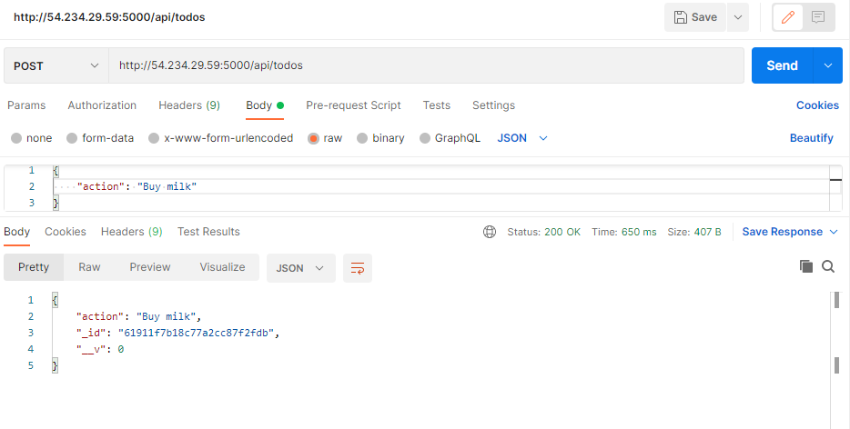

# MERN STACK IMPLEMENTATION ON AWS EC2


### Step 1 – Install Node.js, npm and create a new project

1. Run the following command to install Node.js:
```
sudo apt-get update
sudo apt-get install nodejs # run node -v afterwards to check version
```
2. Installing Nodejs above did not install NPM. So I ran the following command to install npm:
```
sudo apt-get install npm #run npm -v afterwards to check version
```
3. Now we can create a new project. Run the following command to create a new project:
```
mkdir Todo # create a new folder named Todo
npm init -y # initialises a new project
```


4. Run 'ls' to see the new folder contents. Package.json would have being create and it is the file that contains the project's dependencies.

### Step 2 – Install Express.js
1. Run the following command to install Express.js:
```
npm install express --save # installs express and saves it to package.json
```
2. create a new file called index.js in the Todo folder. This starts up ther express server.
```
touch index.js
```
3. Install dotenv to read environment variables from a .env file.
```
npm install dotenv --save # installs dotenv and saves it to package.json
```
4. Edit the index.js file to include the following code:  
```
const express = require('express');
require('dotenv').config();

const app = express();

const port = process.env.PORT || 5000; # process.env.PORT is the port number that the server is running on. This server will run on port 5000 if the environment variable PORT is not set.

app.use((req, res, next) => {
res.header("Access-Control-Allow-Origin", "\*");
res.header("Access-Control-Allow-Headers", "Origin, X-Requested-With, Content-Type, Accept");
next();
});

app.use((req, res, next) => {
res.send('Welcome to Express');
});

app.listen(port, () => {
console.log(`Server running on port ${port}`)
});
```
5. Start the express server by running the following command:
```
node index.js
```


N.B. The server is going to run on port 5000.

6. We need to expose port 5000 on our imboud rules just like we did for the apache and nginx server.
The website should be visible at http://Ip-address:5000/
 

For the todo app to perform different tasks, we need to create api endpoints. This endpoints will use the  POST, GET, and DELETE methods.

1. Create routes folder and create an api.js file thats going to contain the api endpoints.
```
mkdir routes
touch api.js
```
2. Edit api.js with the following code block:
```
const express = require ('express');
const router = express.Router();

router.get('/todos', (req, res, next) => {

});

router.post('/todos', (req, res, next) => {

});

router.delete('/todos/:id', (req, res, next) => {

})

module.exports = router;
```
3. Install mongoose which helps us connect to mongodb.
```
npm install mongoose --save
```
4. Create models folder and create a todo.js file in it.
```
mkdir models
touch todo.js
```
5. Edit todo.js with the following code block:
```
const mongoose = require('mongoose');
const Schema = mongoose.Schema;

//create schema for todo
const TodoSchema = new Schema({
action: {
type: String,
required: [true, 'The todo text field is required']
}
})

//create model for todo
const Todo = mongoose.model('todo', TodoSchema);

module.exports = Todo;
```
6.  Update the api.js file in routes folder to include the following code which will make use of model:
```
const express = require ('express');
const router = express.Router();
const Todo = require('../models/todo');

router.get('/todos', (req, res, next) => {

//this will return all the data, exposing only the id and action field to the client
Todo.find({}, 'action')
.then(data => res.json(data))
.catch(next)
});

router.post('/todos', (req, res, next) => {
if(req.body.action){
Todo.create(req.body)
.then(data => res.json(data))
.catch(next)
}else {
res.json({
error: "The input field is empty"
})
}
});

router.delete('/todos/:id', (req, res, next) => {
Todo.findOneAndDelete({"_id": req.params.id})
.then(data => res.json(data))
.catch(next)
})

module.exports = router;
```
7. Create a modngoDB database called todoDb on mongodb.com, create a user, allow connection anywhere and also create a collection called todo.
 
 
 

8. Create a .env file in the root directory of the project and add the following code:
```
DB = mongodb+srv://lordwales:<password>@cluster0.xmaqr.mongodb.net/myFirstDatabase?retryWrites=true&w=majority
```
9. Edit the index.js file to include the following code:
```
const express = require('express');
const bodyParser = require('body-parser');
const mongoose = require('mongoose');
const routes = require('./routes/api');
const path = require('path');
require('dotenv').config();

const app = express();

const port = process.env.PORT || 5000;

//connect to the database
mongoose.connect(process.env.DB, { useNewUrlParser: true, useUnifiedTopology: true })
.then(() => console.log(`Database connected successfully`))
.catch(err => console.log(err));

//since mongoose promise is depreciated, we overide it with node's promise
mongoose.Promise = global.Promise;

app.use((req, res, next) => {
res.header("Access-Control-Allow-Origin", "\*");
res.header("Access-Control-Allow-Headers", "Origin, X-Requested-With, Content-Type, Accept");
next();
});

app.use(bodyParser.json());

app.use('/api', routes);

app.use((err, req, res, next) => {
console.log(err);
next();
});

app.listen(port, () => {
console.log(`Server running on port ${port}`)
});
```

10. Run the server by running the following command:
```
node index.js
```
 

11.The images bellow show the use of GET,POST and DELETE methods to quesry the database.
 
 
 
 


## FRONTEND

1. Scaffold a new react project in the root directory of your project with the following commands:
```
 npx create-react-app client
```
This creates a client folder in the root directory of your project.

2. Install the following dependencies:
```
npm install concurrently --save-dev # used to run more than one command from the same terminal
npm install nodemon --save-dev # used to run and monitor the server againsta any changes.
```
3. Edit the scripts section in package.json in the root directory of your project with the following code:
```
"scripts": {
"start": "node index.js",
"start-watch": "nodemon index.js",
"dev": "concurrently \"npm run start-watch\" \"cd client && npm start\""
},
```
4. Add a proxy to the server in the pacakge.json client folder with the following code:
```
"proxy": "http://Ip-address:5000"
```
5. Cd to the root folder and Start the  app in development mode by running the following command:
```
npm run dev

```
 

6. Enabled port 3000 on the EC2 server inbound rules and

7. Create a components folder in src and create Input.js, Todo.js and ListTodo.js files in the components folder.
```
mkdir src/components
touch Input.js
touch Todo.js
touch ListTodo.js
```
8. CD back to src/components folder and Edit the Input.js file with the following code:
```
import React, { Component } from 'react';
import axios from 'axios';

class Input extends Component {

state = {
action: ""
}

addTodo = () => {
const task = {action: this.state.action}

    if(task.action && task.action.length > 0){
      axios.post('/api/todos', task)
        .then(res => {
          if(res.data){
            this.props.getTodos();
            this.setState({action: ""})
          }
        })
        .catch(err => console.log(err))
    }else {
      console.log('input field required')
    }

}

handleChange = (e) => {
this.setState({
action: e.target.value
})
}

render() {
let { action } = this.state;
return (
<div>
<input type="text" onChange={this.handleChange} value={action} />
<button onClick={this.addTodo}>add todo</button>
</div>
)
}
}

export default Input
```

9. Install Axio which helps our application to make http requests to the server.
```
npm install axios 
```
10. Edit the ListTodo.js file with the following code:
```
import React from 'react';

const ListTodo = ({ todos, deleteTodo }) => {

return (
<ul>
{
todos &&
todos.length > 0 ?
(
todos.map(todo => {
return (
<li key={todo._id} onClick={() => deleteTodo(todo._id)}>{todo.action}</li>
)
})
)
:
(
<li>No todo(s) left</li>
)
}
</ul>
)
}

export default ListTodo
```

10. Edit Todo.js file with the following code:
```
import React, {Component} from 'react';
import axios from 'axios';

import Input from './Input';
import ListTodo from './ListTodo';

class Todo extends Component {

state = {
todos: []
}

componentDidMount(){
this.getTodos();
}

getTodos = () => {
axios.get('/api/todos')
.then(res => {
if(res.data){
this.setState({
todos: res.data
})
}
})
.catch(err => console.log(err))
}

deleteTodo = (id) => {

    axios.delete(`/api/todos/${id}`)
      .then(res => {
        if(res.data){
          this.getTodos()
        }
      })
      .catch(err => console.log(err))

}

render() {
let { todos } = this.state;

    return(
      <div>
        <h1>My Todo(s)</h1>
        <Input getTodos={this.getTodos}/>
        <ListTodo todos={todos} deleteTodo={this.deleteTodo}/>
      </div>
    )

}
}

export default Todo;
```

11. cd to the src folder and edit App.js with the following code:
```
import React from 'react';

import Todo from './components/Todo';
import './App.css';

const App = () => {
return (
<div className="App">
<Todo />
</div>
);
}

export default App;
```

12. Edit App.css file with the following code:
```
.App {
text-align: center;
font-size: calc(10px + 2vmin);
width: 60%;
margin-left: auto;
margin-right: auto;
}

input {
height: 40px;
width: 50%;
border: none;
border-bottom: 2px #101113 solid;
background: none;
font-size: 1.5rem;
color: #787a80;
}

input:focus {
outline: none;
}

button {
width: 25%;
height: 45px;
border: none;
margin-left: 10px;
font-size: 25px;
background: #101113;
border-radius: 5px;
color: #787a80;
cursor: pointer;
}

button:focus {
outline: none;
}

ul {
list-style: none;
text-align: left;
padding: 15px;
background: #171a1f;
border-radius: 5px;
}

li {
padding: 15px;
font-size: 1.5rem;
margin-bottom: 15px;
background: #282c34;
border-radius: 5px;
overflow-wrap: break-word;
cursor: pointer;
}

@media only screen and (min-width: 300px) {
.App {
width: 80%;
}

input {
width: 100%
}

button {
width: 100%;
margin-top: 15px;
margin-left: 0;
}
}

@media only screen and (min-width: 640px) {
.App {
width: 60%;
}

input {
width: 50%;
}

button {
width: 30%;
margin-left: 10px;
margin-top: 0;
}
}
```
13. Edit the index.css file to include the following code:
```
body {
margin: 0;
padding: 0;
font-family: -apple-system, BlinkMacSystemFont, "Segoe UI", "Roboto", "Oxygen",
"Ubuntu", "Cantarell", "Fira Sans", "Droid Sans", "Helvetica Neue",
sans-serif;
-webkit-font-smoothing: antialiased;
-moz-osx-font-smoothing: grayscale;
box-sizing: border-box;
background-color: #282c34;
color: #787a80;
}

code {
font-family: source-code-pro, Menlo, Monaco, Consolas, "Courier New",
monospace;
}
```

13. cd to root folder to start the app in development mode.
```
npm run dev
```
 
