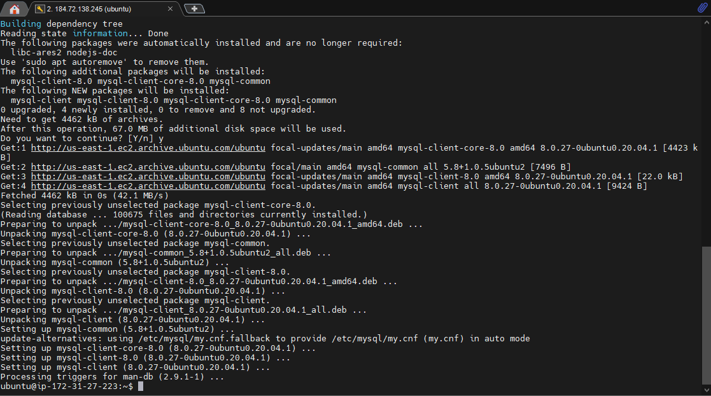
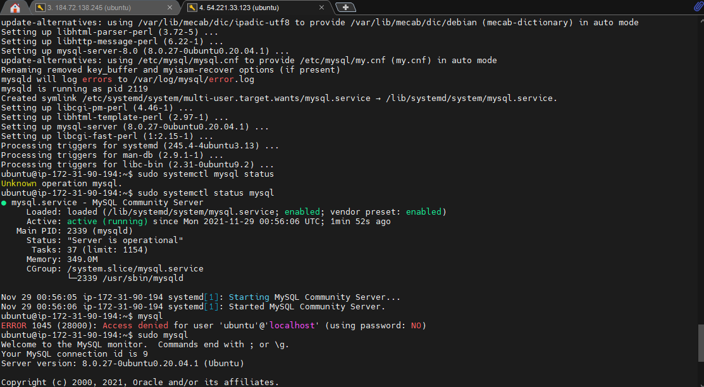
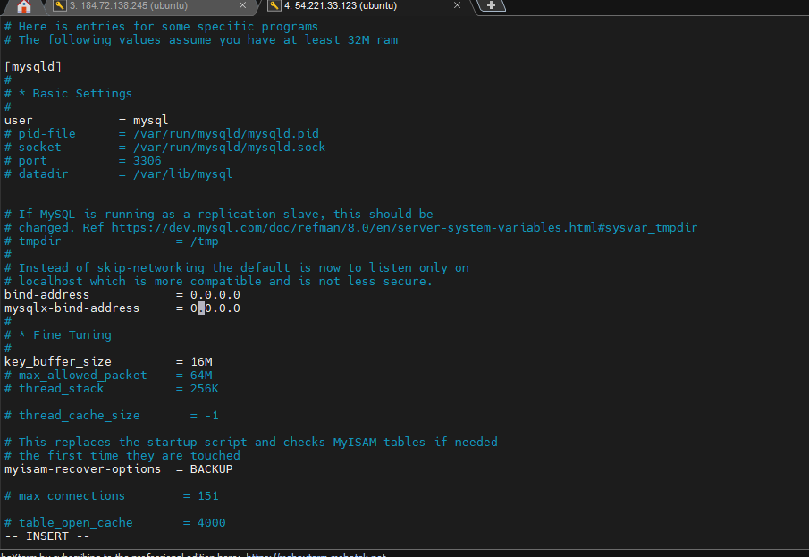
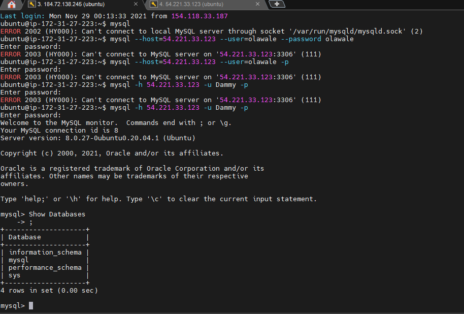

# CLIENT SERVER ARCHITECTURE USING MYSQL DATABASE MANAGEMENT SYSTEM (DBMS).

Lauch two (2) EC2 instances. First one for the client and second one for the server. Add an inbound rule to the security group of the server instance to allow the client instance to connect to the server instance (allow only the IP address of the client server on MYSQL Default port 3306).

### STEP 1: Installing the MySQL Client on server 1
1. Update the apt package index and install the package.
```
sudo apt-get update
sudo apt-get install mysql-client
```


### STEP 2: Installing the MySQL Server on server 2
1. Update the apt package index and install the package.
```
sudo apt-get update
sudo apt-get install mysql-server
```


2. Edit MYSQL configuration file to allow remote access to MySQL server and replace <b> 127.0.0.1</b> with <b> 0.0.0.0</b>.
```
sudo nano /etc/mysql/mysql.conf.d/mysqld.cnf
```


3. Restart MySQL server.
```
sudo service mysql restart
```
4. Create a new user and database for the project.
```
mysql -u root -p
CREATE USER 'Dammy'@'%' IDENTIFIED WITH mysql_native_password BY 'Wales';
GRANT ALL PRIVILEGES ON *.* TO 'Dammy'@'%' WITH GRANT OPTION;
CREATE DATABASE projectlamp;
```

### STEP 3: Connecting to the MySQL Server on server 2 from the client on server 1
1. Connect to the MySQL server using the following command:
```
mysql --host=54.221.33.123  --user=Dammy -p OR mysql -h localhost -u myname -p mydb
```

 


