# WEB SOLUTION WITH WORDPRESS

### STEP 1 — PREPARING THE WEB SERVER

1. Launch an EC2 Instance and create a volumes to be added to the server
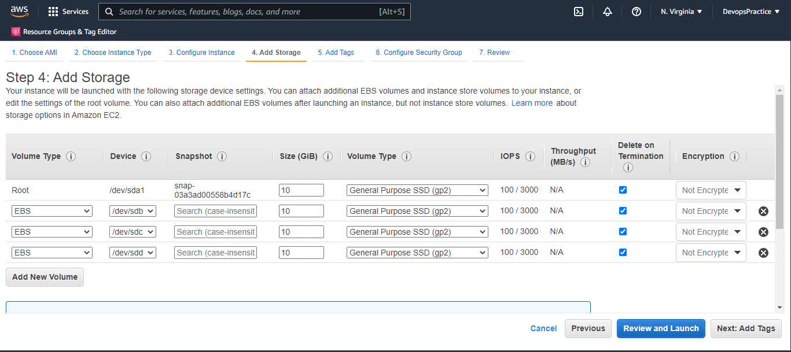
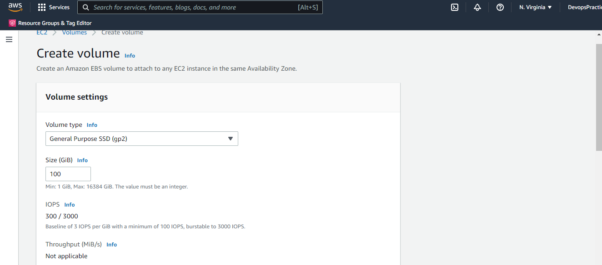


2. Inspect the block devices attached to the server
```
lsblk
```
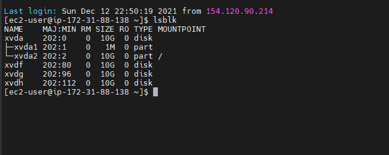

3. Check mounts and free space available on the server
```
 df -h
```
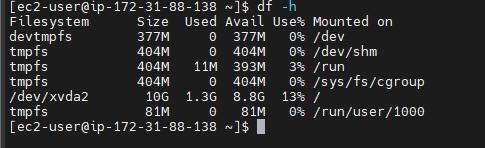

4. Create single partition on each of the 3  using gdisk utility.
```
sudo gdisk /dev/xvdh
```
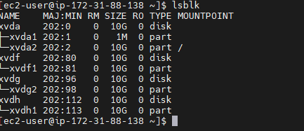

5. Install lvm2 pacakage on the server soa s that it can be used to create a volume group etc.
```
sudo yum install lvm2
```

6. Run the following command to scan for the available partition created.
```
sudo lvmdiskscan
```
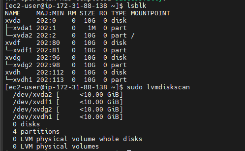

7. To create Physical volumes from each partition created, run the following command.
```
sudo pvcreate /dev/xvdf1
sudo pvcreate /dev/xvdg2
sudo pvcreate /dev/xvdh1
```
8. Verify that PV has been created successfully.
```
sudo pvs
```
9. Create a volume group and add the physical volumes to it.
```
sudo vgcreate webdata-vg /dev/xvdf1 /dev/xvdg2 /dev/xvdh1
```
10. Verify that the volume group has been created successfully.
```
sudo vgs
```
11. Create a logical volume for the web data VG.
```
sudo lvcreate -n apps-lv -L 14G webdata-vg
sudo lvcreate -n logs-lv -L 14G webdata-vg
```
12. Verify that the logical volume has been created successfully.
```
sudo lvs
```
13. Verify that all setup is complete.
```
sudo vgdisplay -v #view complete setup - VG, PV, and LV
sudo lsblk 
```
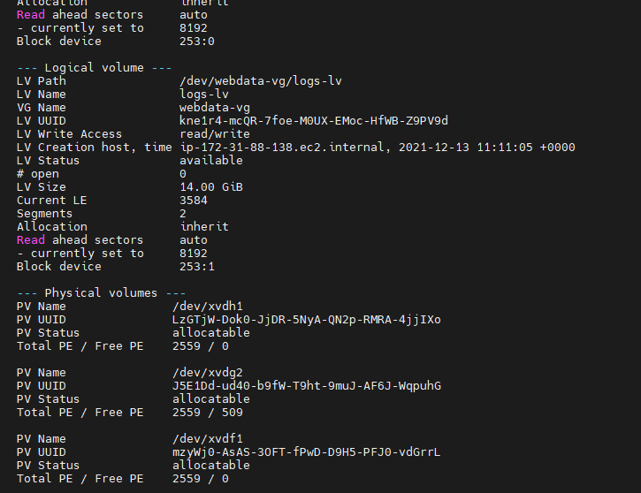
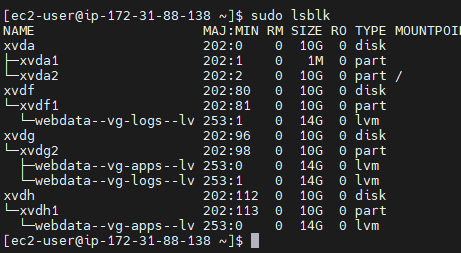
14. Format the Logical volume with ext4 file system.
```
sudo mkfs.ext4 /dev/webdata-vg/apps-lv
sudo mkfs.ext4 /dev/webdata-vg/logs-lv
```
15. Create directory to store application files at /var/www/html
```
sudo mkdir -p /var/www/html
```
Create a directory to store logs at /home/recovery/logs
```
sudo mkdir -p /home/recovery/logs
```
16. Mount /var/www/html into the apps-lv logical volume.
```
sudo mount /dev/webdata-vg/apps-lv /var/www/html
```
17. Backup /var/log into home/recovery/logs with the following command.
```
sudo rsync -av /var/log /home/recovery/logs
```
18. Mount /var/log/ into the logs-lv logical volume.
```
sudo mount /dev/webdata-vg/logs-lv /var/log/ #this action will clear all files inside /var/log/. The reason we created home/recovery/logs in step 15.
```
19. Restore /var/log from home/recovery/logs with the following command.
```
sudo rsync -av /home/recovery/logs /var/log
```
20. Update /etc/fstab file so that the mount configuration will persist after restart of the server. Run the following command to update the fstab file.
```
sudo blkid # outputs the UUID of te LVs which will be used in the fstab file
sudo vi /etc/fstab
```
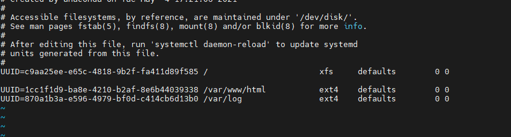
21. Test the configuration and reload the daemon
```
sudo mount -a
sudo systemctl daemon-reload
```
22. Verify all setup is complete.
```
df -h
```
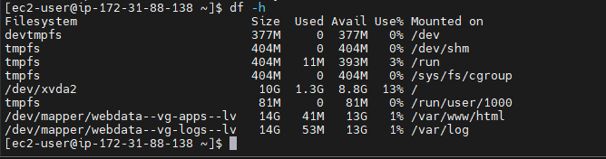


STEP 2 - PREPARE THE DATABASE SERVER

Followed all the steps from the previous section. and replaced apps-lv with db-lv.


STEP 3 - INSTALL WORDPRESS ON WEB SERVER

1. Update repository list  and install wget and Apache with the following commands.
```
sudo yum update
sudo yum install wget httpd php php-mysqlnd php-fpm php-json php-gd php-mbstring php-xml php-xmlrpc php-soap
```
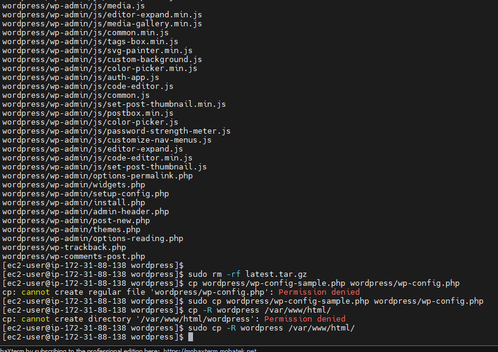
2. Start the httpd service and enable it to start on boot.
```
sudo systemctl enable httpd
sudo systemctl start httpd

```
3. Download php dependencies.
```
sudo yum install https://dl.fedoraproject.org/pub/epel/epel-release-latest-8.noarch.rpm
sudo yum install yum-utils http://rpms.remirepo.net/enterprise/remi-release-8.rpm
sudo yum module list php
sudo yum module reset php
sudo yum module enable php:remi-7.4
sudo yum install php-opcache php-curl
sudo systemctl start php-fpm
sudo systemctl enable php-fpm
sudo setsebool -P httpd_execmem 1
```
4. Restart the httpd service.
```
sudo systemctl restart httpd
```
5. Download WordPress and copy it to the /var/www/html directory.
```
mkdir wordpress
cd   wordpress
sudo wget http://wordpress.org/latest.tar.gz
sudo tar xzvf latest.tar.gz
sudo rm -rf latest.tar.gz
cp wordpress/wp-config-sample.php wordpress/wp-config.php
cp -R wordpress /var/www/html/
```
6. Configure SELinux Policies
```
sudo chown -R apache:apache /var/www/html/wordpress
sudo chcon -t httpd_sys_rw_content_t /var/www/html/wordpress -R
sudo setsebool -P httpd_can_network_connect 1
```

### STEP 4 - INSTALL MYSQL ON DATABASE SERVER

1. Install MySQL server.
```
sudo yum update
sudo yum install mysql-server
```

2. Restart and enable MYSQL service.
```
sudo systemctl enable mysqld
sudo systemctl start mysqld

```

### step 5 - CREATE DATABASE FOR WordPress

```
sudo mysql
CREATE DATABASE wordpress;
CREATE USER `Dammy`@`54.221.33.123` IDENTIFIED BY 'Wales';
GRANT ALL ON wordpress.* TO 'Dammy'@'54.221.33.123';
FLUSH PRIVILEGES;
SHOW DATABASES;
exit
```
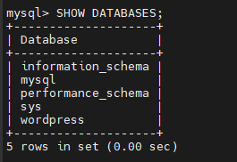

### STEP 5 - CONFIGURE WEBSERVER TO CONNECT TO DB SERVER

1. Expose port 3306 on DB server to the IP Address of webserver

2. Install MYSQL Client on webserver.
```
sudo yum install mysql
```
3. connect to DB server
```
sudo mysql -u Dammy -p -h 54.221.33.123
```
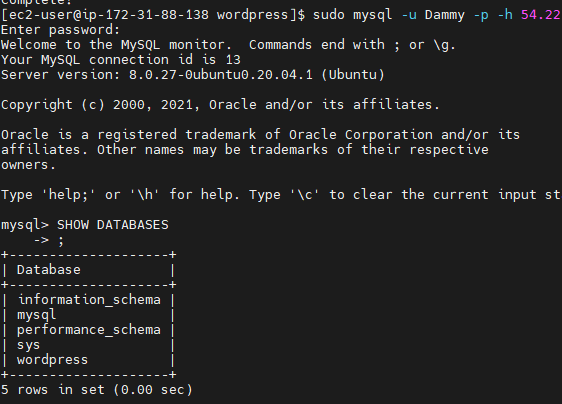
4. Change permissions and configuration so Apache could use WordPress:
```
sudo chown -R apache:apache /var/www/html/wordpress
```
5. Enable Port 80 in Inbound rules for web server.

6. Install WordPress at http://<Web-Server-Public-IP-Address>/wordpress/
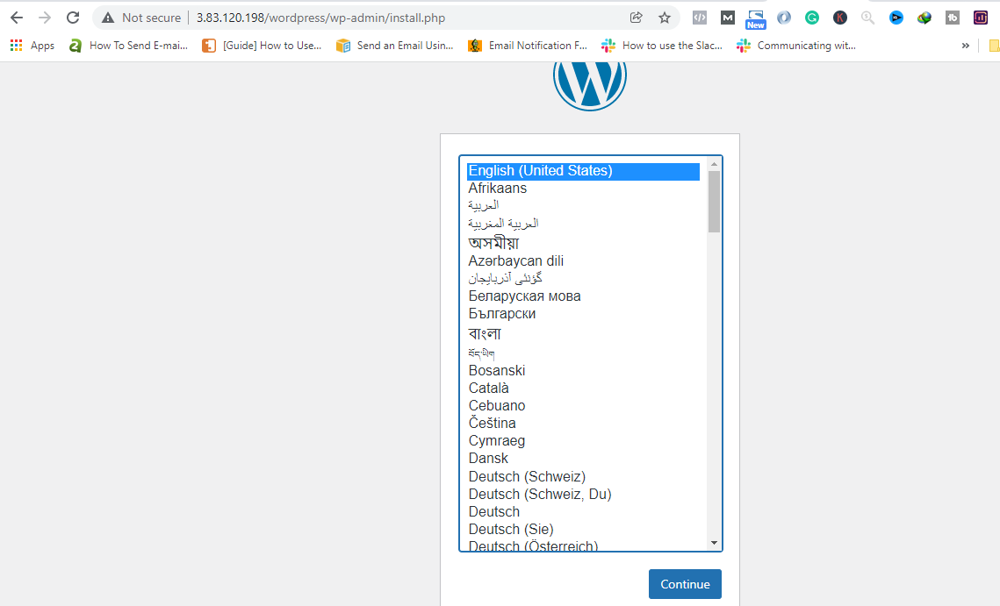
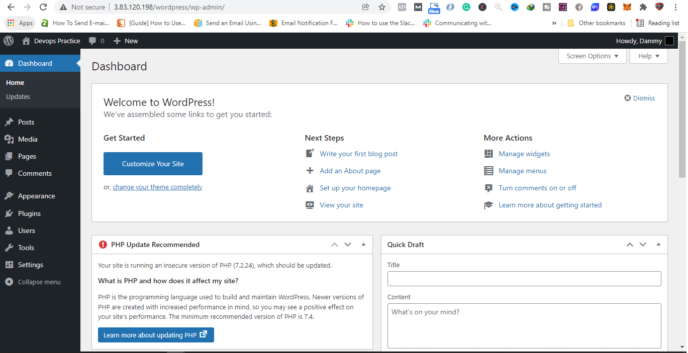
