# DEVOPS TOOLING WEBSITE SOLUTION

### STEP 1 – PREPARE NFS SERVER

1. Spin up a RHEL Linux EC2 Instance

2. Configure LVM on the Instance using "xfs" to format the disks instead of ext4.
<br>
N.B: There are 3 Logical Volumes. <b>lv-opt, lv-apps, and lv-logs</b>
</br>
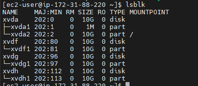
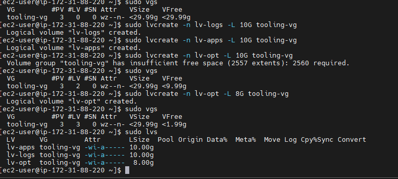

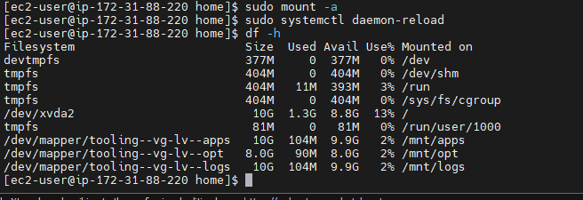
3. Create mount points on /mnt directory for the logical volumes:

    *Mount lv-apps on /mnt/apps – for webservers <br>
    Mount lv-logs on /mnt/logs – for webserver logs <br>
    Mount lv-opt on /mnt/opt – for Jenkins*

4. Install NFS server and configure it to start on reboot
```
sudo yum -y update
sudo yum install nfs-utils -y
sudo systemctl start nfs-server.service
sudo systemctl enable nfs-server.service
sudo systemctl status nfs-server.service
```
5. Export the mounts for webservers subnet cidr to connect as clients. These webservers can be in the same subnet or in different subnets. For test purposes, we used same subnets but for production we would want to separate each tier inside its own subnet for higher level of security.
<br>
<br>
a. Set up permission that will allow our Web servers to read, write and execute files on NFS:
 ```
    sudo chown -R nobody: /mnt/apps
    sudo chown -R nobody: /mnt/logs
    sudo chown -R nobody: /mnt/opt

    sudo chmod -R 777 /mnt/apps
    sudo chmod -R 777 /mnt/logs
    sudo chmod -R 777 /mnt/opt

    sudo systemctl restart nfs-server.service
 ``` 
<br>
b. Configure access to NFS for clients within the same subnet (example of Subnet CIDR – 172.31.32.0/20 ):

```
    sudo vi /etc/exports
    /mnt/apps <Subnet-CIDR>(rw,sync,no_all_squash,no_root_squash)
    /mnt/logs <Subnet-CIDR>(rw,sync,no_all_squash,no_root_squash)
    /mnt/opt <Subnet-CIDR>(rw,sync,no_all_squash,no_root_squash)

    Esc + :wq!

    sudo exportfs -arv
```    
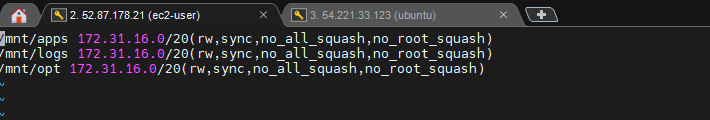
6. Check which port is used by NFS and open it using Security Groups (add new Inbound Rule) on the NFS server.
```
rpcinfo -p | grep nfs
```
N.B: <i>In order for NFS server to be accessible from your client, you must also open following ports: TCP 111, UDP 111, UDP 2049 </i>

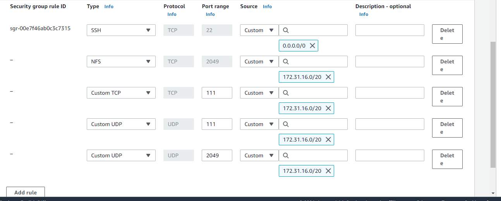

### STEP 2 — CONFIGURE THE DATABASE SERVER

1. Create a new EC2 Instance for Database server. I already have a DB server instance, so I will use that.
2. Create a new Database called tooling
```
CREATE DATABSE tooling;
```

3. Create a new user called webaccess and assign a password to it. Also grant all priviledges to the user from the webserver subnet cidr.
```
CREATE USER 'webaccess'@'<subnet-cidr>' IDENTIFIED WITH mysql_native_password BY 'Wales';
GRANT ALL PRIVILEGES ON *.* TO 'webaccess'@'<subnet-cidr>' WITH GRANT OPTION;
```


### STEP 3 — CONFIGURE THE WEBSERVER

Since we are using NFS, all our webservers can access the storage and can use the same storage. Once we add or make changes on one server, the other servers will automatically get the changes.

During the next steps we will do following:

- Configure NFS client (this step must be done on all three servers)
<br>
- Deploy a Tooling application to our Web Servers into a shared NFS folder
<br>
- Configure the Web Servers to work with a single MySQL database

We will use the following steps to configure each of the webservers:

<b><i>Repeat steps 1-5 for another 2 Web Servers.</i> <br>
<i>Do not forget to open TCP port 80 on the Web Server.</i></b>
1. Create a new EC2 Instance for each webserver.
2. Install NFS client
```
sudo yum -y update
sudo yum install nfs-utils nfs4-acl-tools -y
```
3. Mount /var/www/ and target the NFS server’s export for apps
```
sudo mkdir /var/www
sudo mount -t nfs -o rw,nosuid <NFS-Server-Private-IP-Address>:/mnt/apps /var/www
```
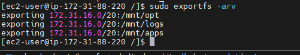

4. Verify that the mount was successful and also update the etc/fstab file to make sure the mount stays intact after reboot.
```
df -h
sudo vi /etc/fstab
<NFS-Server-Private-IP-Address>:/mnt/apps /var/www nfs defaults 0 0
```
5. Install Remi’s repository, Apache,PHP and its dependencies

```
sudo yum install httpd -y

sudo dnf install https://dl.fedoraproject.org/pub/epel/epel-release-latest-8.noarch.rpm

sudo dnf install dnf-utils http://rpms.remirepo.net/enterprise/remi-release-8.rpm

sudo dnf module reset php

sudo dnf module enable php:remi-7.4

sudo dnf install php php-opcache php-gd php-curl php-mysqlnd

sudo systemctl start php-fpm

sudo systemctl enable php-fpm

setsebool -P httpd_execmem 1
```
6. Verify that Apache files and directories are available on the Web Server in /var/www and also on the NFS server in /mnt/apps.
You can verify by creating a file on webserver 1 and check webserver 2 if its available.

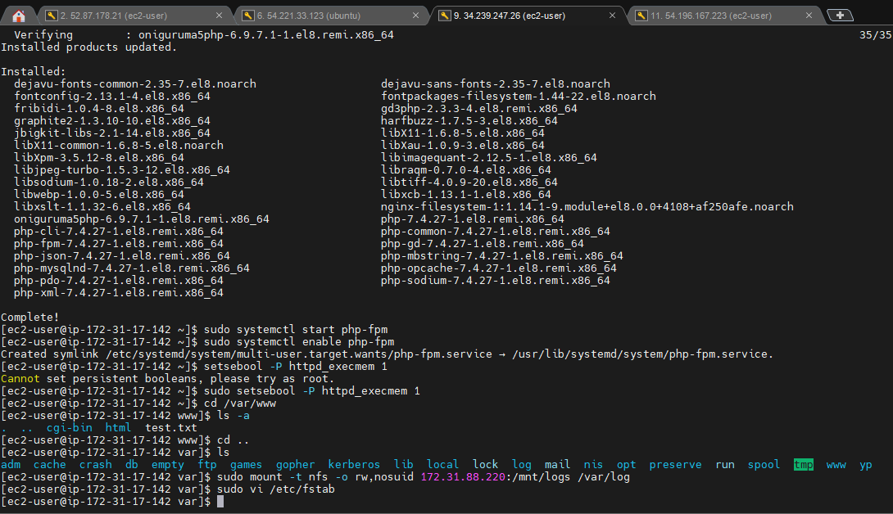
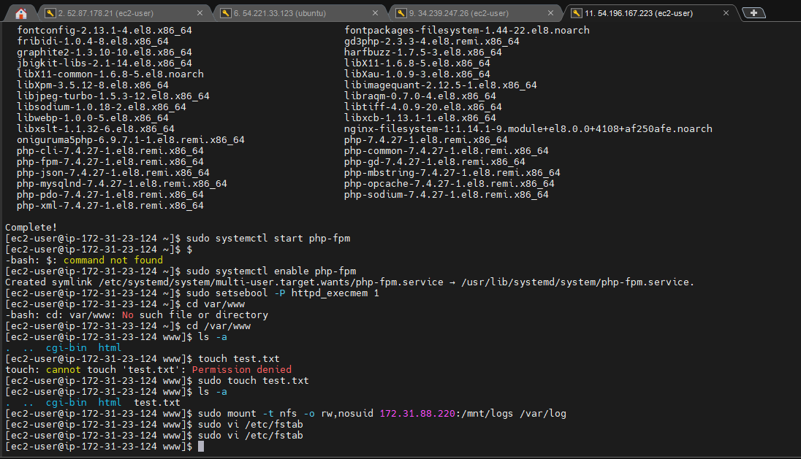
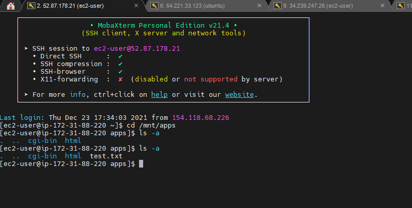

7. mount var/log and target the NFS server’s export for logs

```
sudo mount -t nfs -o rw,nosuid <NFS-Server-Private-IP-Address>:/mnt/logs /var/log
```
Also update the etc/fstab file also on each webservers

8. Deploy the code to /var/www/html folder in one of the webservers.

You can do this by installing git on one of the servers and clone the repo into the folder
```
sudo yum install git
sudo git clone <repo link>
cp -a /var/www/html/<repo name>/* /var/www/html/
```
N.B:<i> If you encounter 403 Error – check permissions to your /var/www/html folder and also disable SELinux sudo setenforce 0
To make this change permanent – open following config file sudo vi /etc/sysconfig/selinux and set SELINUX=disabledthen restrt httpd. </i>


9. Update the website’s configuration to connect to the database (in /var/www/html/functions.php file). Apply tooling-db.sql script to your database using this command 
```
mysql -h <databse-private-ip> -u <db-username> -p <db-pasword> < tooling-db.sql
```
<b>N.B: Open a Mysql port 3306 for webservers in the subnet cidr where the webservers are located.</b>
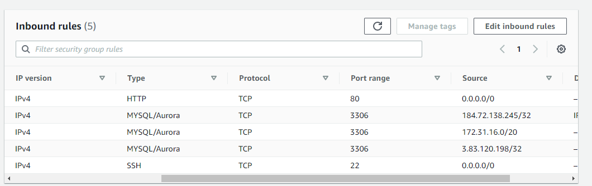

10. Create in MySQL a new admin user with username: myuser and password: password:
```
INSERT INTO users (id,username,password,email,user_type,status) VALUES (2,'myuser', '5f4dcc3b5aa765d61d8327deb882cf99', 'user@mail.com', 'admin', 1);
```
11. Open the website in your browser http://<Web-Server-Public-IP-Address-or-Public-DNS-Name>/index.php and logged into the website with myuser user.

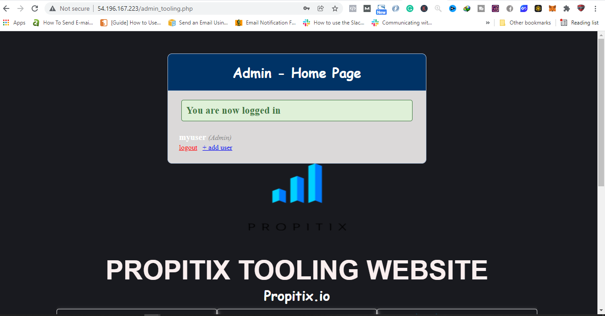
