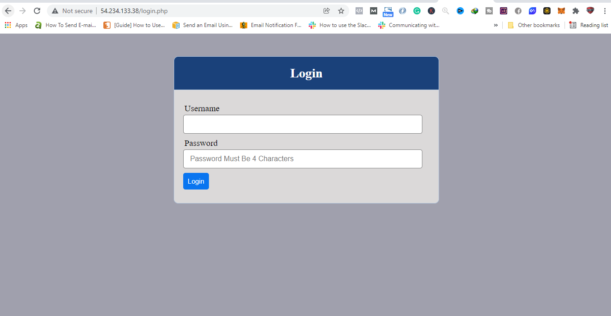
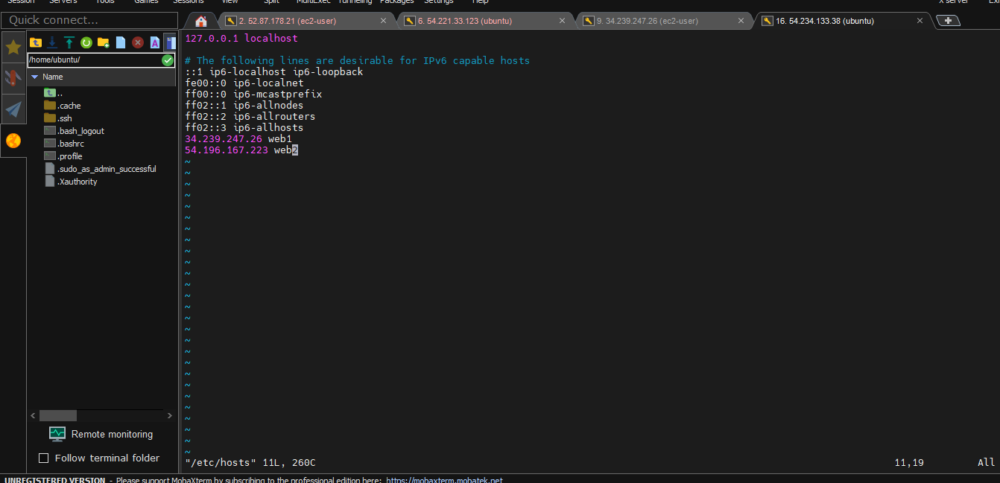

# CONFIGURE APACHE AS A LOAD BALANCER

### Configure Apache As A Load Balancer
1. Create a new ec2 instance for the load balanacer
2. Open TCP Port 80 in Inbound rules for the load balancer security group
3. Install Apache Load Balancer on Project-8-apache-lb server and configure it to point traffic coming to LB to both Web Servers:
```
#Install apache2
sudo apt update
sudo apt install apache2 -y
sudo apt-get install libxml2-dev

#Enable following modules:
sudo a2enmod rewrite
sudo a2enmod proxy
sudo a2enmod proxy_balancer
sudo a2enmod proxy_http
sudo a2enmod headers
sudo a2enmod lbmethod_bytraffic

#Restart apache2 service
sudo systemctl restart apache2
```
4. Configure Apache Load Balancer to point traffic coming to LB to both Web Servers:
```
sudo vi /etc/apache2/sites-available/000-default.conf

#Add this configuration into this section <VirtualHost *:80>  </VirtualHost>

<Proxy "balancer://mycluster">
               BalancerMember http://<WebServer1-Private-IP-Address>:80 loadfactor=5 timeout=1
               BalancerMember http://<WebServer2-Private-IP-Address>:80 loadfactor=5 timeout=1
               ProxySet lbmethod=bytraffic
               # ProxySet lbmethod=byrequests
        </Proxy>

        ProxyPreserveHost On
        ProxyPass / balancer://mycluster/
        ProxyPassReverse / balancer://mycluster/

#Restart apache server

```
5. Restart the server
```
sudo systemctl restart apache2
```
6. Accessed the load balancer IP address and it routes to the webservers
<br>


### EXTRA 

Because it can be difficult to switch between IP Addresses, we 
can give names to the webservers.
We can do this by editing the /etc/hosts file. Though it is not scalable.
<br>

<b>N.B: This names are only local to the load balancer. Ther are not resolvable outside the loadbalancer </b>

```
#Open this file on your LB server

sudo vi /etc/hosts

#Add 2 records into this file with Local IP address and arbitrary name for both of your Web Servers

<WebServer1-Private-IP-Address> Web1
<WebServer2-Private-IP-Address> Web2
```

Now we can edit the /etc/apache2/sites-available/000-default.conf file and add the following configuration:

```
BalancerMember http://Web1:80 loadfactor=5 timeout=1
BalancerMember http://Web2:80 loadfactor=5 timeout=1
```
